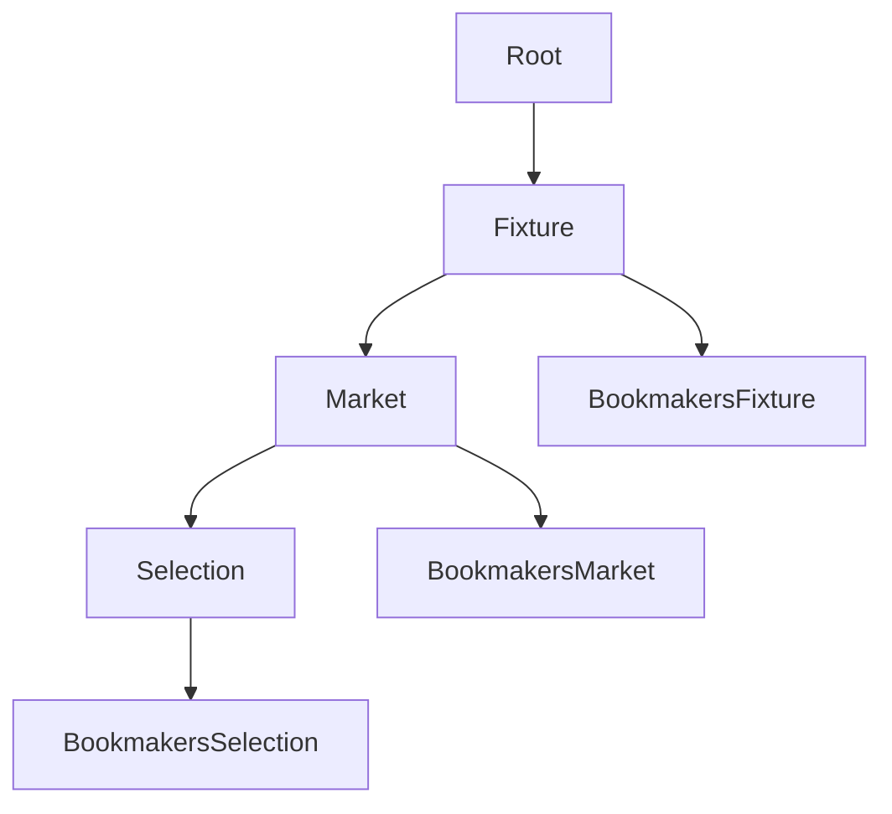

# Link Consumer

This sample demonstrates a connection to your tenant links event hub, deserializing entities, and caching link state in-memory.

## Model

```mermaid
graph TD;
    Root-->Fixture;
    Fixture-->Market;
    Market-->Selection;
    Fixture-->BookmakersFixture;
    Market-->BookmakersMarket;
    Selection-->BookmakersSelection;
```
