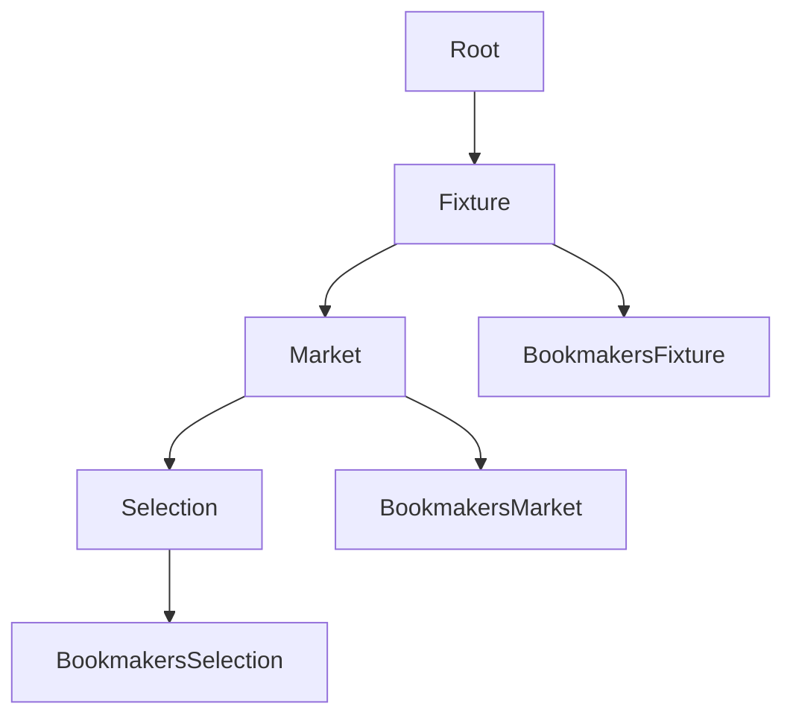

# Link Consumer
This sample demonstrates a connection to your tenant links event hub, deserializing entities, and caching link state in-memory.

## Usage
You'll need to create an Azure Storage account if you want to use the blob storage checkpointer, then create a _config.json_ file in the base directory with the following settings:
```code
{
  "blobConnectionString": "DefaultEndpointsProtocol=https;AccountName={NAME};AccountKey={KEY};EndpointSuffix=core.windows.net",
  "blobContainerName": "linkconsumersample",
  "eventHubConnectionString": "Endpoint=sb://{TENANT}.servicebus.windows.net/;SharedAccessKeyName=Listen;SharedAccessKey={KEY}",
  "eventHubConsumerGroup": "linkconsumersample",
  "eventHubName": "links"
}
```

## Model

